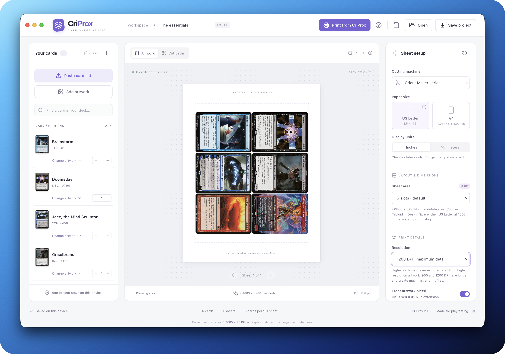

<div align="center">
  
  <h1>CriProx</h1>
  <p><strong>A local-first card sheet studio for Cricut Print Then Cut.</strong></p>
  <p>Turn playtest card lists and custom artwork into precise, reusable print sheets—without an account, cloud workspace, or subscription.</p>

  <p>
    <a href="https://github.com/Go2Engle/CriProx/releases/latest"></a>
    <a href="https://github.com/Go2Engle/CriProx/actions/workflows/ci.yml"></a>
    <a href="LICENSE"></a>
    <a href="https://github.com/sponsors/Go2Engle"></a>
    <a href="https://ko-fi.com/go2engle"></a>
    
    
  </p>

  <p>
    <a href="https://github.com/Go2Engle/CriProx/releases/latest"><strong>Download</strong></a>
    · <a href="docs/CRICUT-WORKFLOW.md">Print guide</a>
    · <a href="docs/FEATURES.md">Features</a>
    · <a href="CONTRIBUTING.md">Contribute</a>
  </p>
</div>



<p align="center"><em>Six-card artwork preview · Demo card imagery loaded through Scryfall.</em></p>

## Why CriProx?

CriProx brings the fiddly parts of a playtest-card workflow into one focused desktop app. Import a deck list, choose printings or custom art, preview the physical layout, and export the matched files needed to finish the job in Design Space.

|                              |                                                                                                                     |
| ---------------------------- | ------------------------------------------------------------------------------------------------------------------- |
| 🔒 **Local-first**           | Projects, imported artwork, and autosaves stay on your device. No account or hosted backend.                        |
| 📐 **Physical dimensions**   | Millimeter-based geometry, standard 63 × 88 mm cards, matched PNG/SVG output, and 300–1200 DPI export.              |
| 🃏 **Flexible artwork**      | Search Scryfall printings, browse MPC Autofill community art, or use local PNG, JPEG, and WebP files.               |
| ✂️ **Reusable cuts**         | Capture a Design Space print PDF once, then place future artwork inside its verified registration marks.            |
| 🔁 **Fronts and backs**      | Export manual-refeed or alternating duplex pages; double-sided cards automatically use their matching reverse face. |
| 💾 **Local project library** | Browse saved projects in CriProx, keep uploaded artwork beside each project, and export portable JSON backups.      |

> [!IMPORTANT]
> CriProx does **not** create Cricut registration marks, produce native Design Space projects, or control a cutting machine. Design Space supplies the sensor marks and cut job. Read the [Cricut workflow and physical validation guide](docs/CRICUT-WORKFLOW.md) before committing a full deck to card stock.

## From card list to cut

1. **Build the sheet.** Import a Moxfield or Archidekt link, paste a deck list, search card printings, or add local artwork.
2. **Dial in the output.** Choose the machine, paper, layout, resolution, bleed, and optional card backs.
3. **Export from CriProx.** Download transparent artwork, matched vector geometry, dimensions, and the Design Space handoff guide.
4. **Print and cut in Design Space.** Preserve the supplied dimensions, print at 100% / Actual size, and complete the cut from the same saved job.

CriProx also supports a registered-print workflow: save a one-page PDF from Design Space, import it into CriProx, and reuse those captured marks for later artwork pages while keeping the cut geometry unchanged.

## Download

Installers for the latest stable release are available on the [GitHub Releases page](https://github.com/Go2Engle/CriProx/releases/latest).

| Platform | Package            | Notes                                                          |
| -------- | ------------------ | -------------------------------------------------------------- |
| macOS    | Universal DMG      | Apple Silicon and Intel; Developer ID signed and notarized     |
| Windows  | x64 NSIS installer | Currently unsigned                                             |
| Linux    | x64 AppImage       | Creates exports; Cricut Design Space is not available on Linux |

The desktop app checks GitHub for newer stable releases and displays a notice; it does not install updates automatically. New releases include a `SHA256SUMS.txt` file for installer verification. See the [installation guide](docs/INSTALLATION.md) for platform notes, the macOS quarantine command, and local-development setup.

## Quick start for contributors

CriProx requires Node.js 22 or newer and npm.

```sh
git clone https://github.com/Go2Engle/CriProx.git
cd CriProx
npm ci
npm run dev
```

Open `http://127.0.0.1:5173`, or run `npm run desktop` to build and launch the Electron app.

```sh
npm test          # Run geometry, parsing, rendering, and validation tests
npm run build     # Type-check and build the production renderer
npm run package   # Build an installer for the current operating system
```

## Documentation

| Guide                                        | What it covers                                                                          |
| -------------------------------------------- | --------------------------------------------------------------------------------------- |
| [Installation](docs/INSTALLATION.md)         | Desktop packages, unsigned-app notes, development, and build commands                   |
| [Feature reference](docs/FEATURES.md)        | Imports, layouts, output formats, project storage, limits, and experimental modes       |
| [Cricut workflow](docs/CRICUT-WORKFLOW.md)   | The Design Space boundary, reusable registration workflow, and physical acceptance test |
| [Software validation](docs/VALIDATION.md)    | Automated and hands-on checks already completed, plus remaining hardware validation     |
| [Architecture](docs/ARCHITECTURE.md)         | Data flow, important modules, Electron security model, and testing strategy             |
| [References and credits](docs/REFERENCES.md) | External workflow documentation, APIs, artwork sources, and project acknowledgements    |
| [Contributing](CONTRIBUTING.md)              | Development expectations, Conventional Commits, pull requests, and releases             |
| [Security](SECURITY.md)                      | Supported versions and private vulnerability reporting                                  |
| [Changelog](CHANGELOG.md)                    | User-visible changes organized by release                                               |

## Project status

CriProx is a software-tested prototype. Its layout, export, density metadata, project validation, and registered-PDF recognition are covered by automated and manual checks. Real-world sensor acquisition, printer scaling, cutter alignment, and repeatability still depend on the exact machine, calibration, printer, paper, and mat.

The default six-card layout and the seven-card 2–3–2 layout both use an experimental Tabloid-to-Letter workflow for US Letter output. Test one size-check sheet and record physical measurements before printing a full deck. The [validation record](docs/VALIDATION.md) tracks what is proven in software and what still needs hardware acceptance.

## Community

Bug reports, focused feature ideas, documentation fixes, and tested pull requests are welcome.

- [Report a bug](https://github.com/Go2Engle/CriProx/issues/new?template=bug_report.yml)
- [Request a feature](https://github.com/Go2Engle/CriProx/issues/new?template=feature_request.yml)
- [Review contribution guidelines](CONTRIBUTING.md)
- [Report a vulnerability privately](https://github.com/Go2Engle/CriProx/security/advisories/new)
- [Support CriProx development on Ko-fi](https://ko-fi.com/go2engle)

## License

CriProx is free and open-source software licensed under the [GNU General Public License v3.0 only](LICENSE). Distributed copies and derivative works must remain under the GPL, with corresponding source made available under its terms. See [NOTICE](NOTICE) for the copyright notice.

Card data and artwork are provided by Scryfall, MPC Autofill contributors, and their respective owners. CriProx is unofficial fan-made software and is not approved, endorsed, sponsored by, or affiliated with Wizards of the Coast, Cricut, Scryfall, or MPC Autofill.
