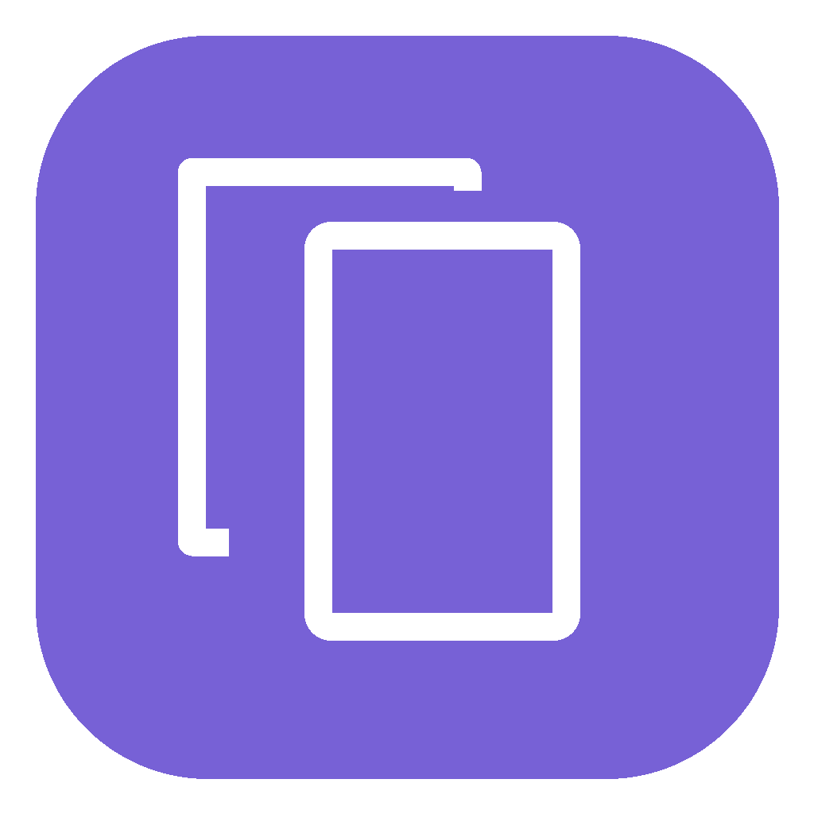
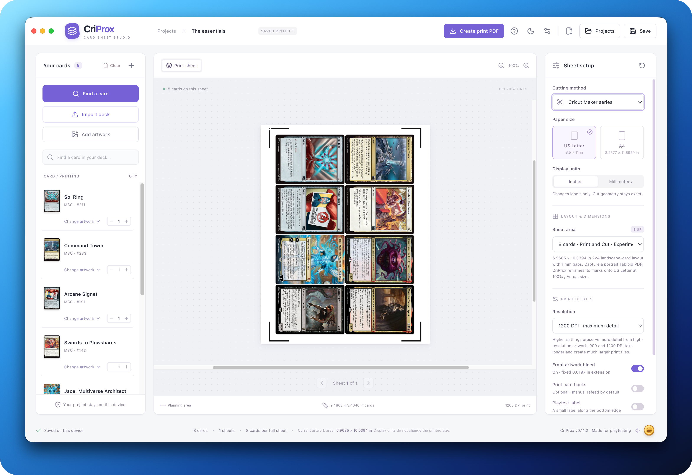

<div align="center">
  
  <h1>CriProx</h1>
  <p><strong>A local-first studio for printable card PDFs and reusable Cricut cuts.</strong></p>
  <p>Turn playtest card lists and custom artwork into precise, reusable print sheets—without an account, cloud workspace, or subscription.</p>

  <p>
    <a href="https://github.com/Go2Engle/CriProx/releases/latest"></a>
    <a href="https://github.com/Go2Engle/CriProx/actions/workflows/ci.yml"></a>
    <a href="LICENSE"></a>
    <a href="https://github.com/sponsors/Go2Engle"></a>
    <a href="https://ko-fi.com/go2engle"></a>
    
    
  </p>

  <p>
    <a href="https://criprox.themanamarket.com/"><strong>Website</strong></a>
    ·
    <a href="https://github.com/Go2Engle/CriProx/releases/latest"><strong>Download</strong></a>
    · <a href="docs/CRICUT-WORKFLOW.md">Print guide</a>
    · <a href="docs/FEATURES.md">Features</a>
    · <a href="CONTRIBUTING.md">Contribute</a>
  </p>
</div>



<p align="center"><em>Eight-card print-sheet preview · Card imagery loaded through Scryfall.</em></p>

## Why CriProx?

CriProx brings the fiddly parts of a playtest-card workflow into one focused desktop app. Import a deck list, choose printings or custom art, and preview the physical layout. Print the finished PDF from a dedicated PDF application, then cut with your saved Design Space project.

|                              |                                                                                                                                  |
| ---------------------------- | -------------------------------------------------------------------------------------------------------------------------------- |
| 🔒 **Local-first**           | Projects, imported artwork, and autosaves stay on your device. No account or hosted backend.                                     |
| 📐 **Physical dimensions**   | Millimeter-based geometry, standard 63 × 88 mm cards, matched PNG/SVG output, and 300–1200 DPI export.                           |
| 🃏 **Flexible artwork**      | Search cards, browse sets or commander precons, choose Scryfall printings or MPC Autofill community art, or use local images.      |
| ✨ **Optional upscale**      | Choose high-detail local 4× enhancement for Scryfall card images when preparing a print PDF; ordinary exports use the originals. |
| ✂️ **Reusable cuts**         | Capture a Design Space template once, print CriProx PDFs from a PDF application, and cut with the same saved project.             |
| ✅ **Compact print workflow** | Completed setup and settings collapse into summaries with green checks. Reopen any section whenever you need it.                 |
| 📐 **Manual nine-card cuts** | Print a 3×3 PDF with paper-edge guides for a trimmer, or use a matched Basic Cut PNG with a Cricut.                              |
| 🔁 **Fronts and backs**      | Export manual-refeed or alternating duplex pages; double-sided cards automatically use their matching reverse face.              |
| 💾 **Local project library** | Browse saved projects, keep uploaded artwork beside each project, and edit reusable sheet, print, artwork, and alignment defaults directly in Settings.                   |

> [!IMPORTANT]
> CriProx does **not** create Cricut registration marks, produce native Design Space projects, or control a cutting machine. Design Space supplies the sensor marks and cut job. The manual nine-card profile deliberately bypasses sensor registration and requires repeatable physical mat placement. Read the [Cricut workflow and physical validation guide](docs/CRICUT-WORKFLOW.md) before committing a full deck to card stock.

## From card list to cut

1. **Build the sheet.** Import a Moxfield or Archidekt link, paste a deck list, search cards, browse a set or commander precon, or add local artwork.
2. **Dial in the output.** Choose the machine, paper, layout, resolution, bleed, and optional card backs. Edit your preferred setup directly in Settings and save it for future projects, or also apply it to the current deck.
3. **Set up the cut template once.** In Create print PDF, download the setup PNG. Upload it to Design Space as a flat Print Then Cut image, preserve the supplied dimensions, and save the project and mat arrangement.
4. **Capture the template once.** Save that Design Space job's print output as a one-page PDF and import it into CriProx to verify and save its registration marks. The setup sections collapse with green checks; choose Done for reviewed settings, and reopen any section from its header.
5. **Print the PDF.** Use the visible prepare controls, review the pages, and save the finished card-sheet PDF from CriProx. Open it in a dedicated PDF application and print at 100% / Actual size, with fit or shrink scaling disabled.
6. **Cut with the saved project.** Reopen the matching Design Space project and mat, choose Already Printed / Skip printing when available, and cut the printed sheet.

Reuse the captured template for later decks with the same cut geometry. Changing paper, spacing, machine, layout, or the saved cut job requires a matching new capture. The [workflow guide](docs/CRICUT-WORKFLOW.md) covers the paper settings and a measured test print and cut before a full deck.

CriProx also exports transparent artwork PNGs, matched vector geometry, dimensions, and a Design Space handoff guide for the separate direct PNG workflow. Those exports do not contain registration marks; use **Create print PDF** for reusable registered pages.

Export filenames use the deck name, output paper, layout, and purpose, such as
`My-Deck-US-Letter-6-card-fronts.pdf` or `My-Deck-US-Letter-6-card-sheet-01-artwork.png`.
Reusable setup images and captured templates describe the machine and cut geometry, so they can be
shared across decks. Manual Cricut PDFs also include readable cut offsets. Existing captured
templates with older filenames still load automatically.

For higher sheet density, the experimental manual profile prints nine cards on Letter or A4 and
downloads a matched 191 × 266 mm Basic Cut PNG. It is a physical alignment workflow, not Print Then
Cut, so validate the page and mat position on plain paper first.

Selecting **Manual cutting** as the machine also uses the nine-card layout. The sheet editor previews
configurable card and page cut guides as you change their separate colors, width, placement, line style, corners,
length, and page style. The front PDF uses those guides; backs remain artwork-only. Cricut registered
layouts show their saved Design Space registration marks and exported card positions in the sheet
preview. Until a matching capture is saved, the preview uses approximate marks. Print at actual size
and check the dimensions before cutting.

## Download

Installers for the latest stable release are available on the [GitHub Releases page](https://github.com/Go2Engle/CriProx/releases/latest).

| Platform | Package            | Notes                                                          |
| -------- | ------------------ | -------------------------------------------------------------- |
| macOS    | Universal DMG      | Apple Silicon and Intel; currently unsigned                    |
| Windows  | x64 NSIS installer | Currently unsigned                                             |
| Linux    | x64 AppImage       | Creates exports; Cricut Design Space is not available on Linux |

### Install on macOS

1. Download the **Universal DMG** from the [latest release](https://github.com/Go2Engle/CriProx/releases/latest).
2. Open the DMG and drag **CriProx** into **Applications**.
3. Because CriProx is not yet signed or notarized, macOS may block the first launch. Only for a copy downloaded from the official repository, open Terminal and run:

   ```sh
   xattr -dr com.apple.quarantine "/Applications/CriProx.app"
   ```

4. Open CriProx from **Applications**.

### Install on Windows

1. Download the **x64 `.exe` installer** from the [latest release](https://github.com/Go2Engle/CriProx/releases/latest).
2. Run the installer. Because CriProx is not yet code-signed, Microsoft Defender SmartScreen may display a warning. If the installer came from the official repository, select **More info**, then **Run anyway**.
3. Complete the setup wizard, then open CriProx from the Start menu or desktop shortcut.

### Update CriProx

CriProx checks GitHub for newer stable releases when the desktop app starts and displays a notice, but it does not install updates automatically.

1. Close CriProx. Export a JSON backup first if you want an additional copy of an important project.
2. Download the package for your operating system from the notice or the [latest release](https://github.com/Go2Engle/CriProx/releases/latest).
3. On macOS, open the new DMG, drag **CriProx** into **Applications**, and choose **Replace**. Run the quarantine command above again if macOS blocks the new version.
4. On Windows, run the new `.exe` installer and complete the setup wizard.
5. Reopen CriProx. Application updates do not replace the managed project library, which is stored in the app's Application Support folder by default or in the folder selected in Settings. When upgrading from v0.6.0 or earlier on macOS, use **Settings → Project library → Import old library** once to copy projects from `Documents/CriProx` without changing the new default.

New releases include a `SHA256SUMS.txt` file for installer verification. See the [installation guide](docs/INSTALLATION.md) for Linux notes, troubleshooting, and local-development setup.

## Quick start for contributors

CriProx requires Node.js 22 or newer and npm.

```sh
git clone https://github.com/Go2Engle/CriProx.git
cd CriProx
npm ci
npm run dev
```

Open `http://127.0.0.1:5173`, or run `npm run desktop` to build and launch the Electron app.

```sh
npm test          # Run geometry, parsing, rendering, and validation tests
npm run build     # Type-check and build the production renderer
npm run package   # Build an installer for the current operating system
```

## Documentation

| Guide                                        | What it covers                                                                          |
| -------------------------------------------- | --------------------------------------------------------------------------------------- |
| [Installation](docs/INSTALLATION.md)         | Desktop packages, unsigned-app notes, development, and build commands                   |
| [Feature reference](docs/FEATURES.md)        | Imports, layouts, output formats, project storage, limits, and experimental modes       |
| [Cricut workflow](docs/CRICUT-WORKFLOW.md)   | The Design Space boundary, reusable registration workflow, and physical acceptance test |
| [Software validation](docs/VALIDATION.md)    | Automated and hands-on checks already completed, plus remaining hardware validation     |
| [Architecture](docs/ARCHITECTURE.md)         | Data flow, important modules, Electron security model, and testing strategy             |
| [References and credits](docs/REFERENCES.md) | External workflow documentation, APIs, artwork sources, and project acknowledgements    |
| [Contributing](CONTRIBUTING.md)              | Development expectations, Conventional Commits, pull requests, and releases             |
| [Security](SECURITY.md)                      | Supported versions and private vulnerability reporting                                  |
| [Changelog](CHANGELOG.md)                    | User-visible changes organized by release                                               |
| [Website automation](docs/WEBSITE.md)        | GitHub Pages publishing, living documentation, and the automated release timeline       |

## Project status

CriProx is a software-tested prototype. Its layout, export, density metadata, project validation, and registered-PDF recognition are covered by automated and manual checks. Real-world sensor acquisition, printer scaling, cutter alignment, and repeatability still depend on the exact machine, calibration, printer, paper, and mat.

The six-card layout uses an experimental Tabloid setup in Design Space to capture a reusable Letter or A4 template; seven-card supports Letter only. Print the finished CriProx PDFs from a dedicated PDF application and cut with the matching saved Design Space project. The eight-card layout captures a full Tabloid PDF from Design Space and reframes its complete marked area onto the selected US Letter or A4 output paper without scaling, provided it fits with at least 1 mm clearance. The Sheet area selector shows only layouts supported by the selected paper and cutting method. Test one size-check sheet and record physical measurements before printing a full deck. The [validation record](docs/VALIDATION.md) tracks what is proven in software and what still needs hardware acceptance.

## Community

Bug reports, focused feature ideas, documentation fixes, and tested pull requests are welcome.

- [Report a bug](https://github.com/Go2Engle/CriProx/issues/new?template=bug_report.yml)
- [Request a feature](https://github.com/Go2Engle/CriProx/issues/new?template=feature_request.yml)
- [Review contribution guidelines](CONTRIBUTING.md)
- [Report a vulnerability privately](https://github.com/Go2Engle/CriProx/security/advisories/new)
- [Support CriProx development on Ko-fi](https://ko-fi.com/go2engle)

## License

CriProx is free and open-source software licensed under the [GNU General Public License v3.0 only](LICENSE). Distributed copies and derivative works must remain under the GPL, with corresponding source made available under its terms. See [NOTICE](NOTICE) for the copyright notice.

Card data and artwork are provided by Scryfall, MPC Autofill contributors, and their respective owners. CriProx is unofficial fan-made software and is not approved, endorsed, sponsored by, or affiliated with Wizards of the Coast, Cricut, Scryfall, or MPC Autofill.
