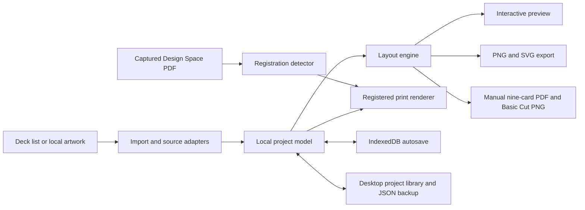

# CriProx architecture

CriProx is a React and TypeScript renderer backed by deterministic, millimeter-based layout and export modules. The same renderer can run in a browser for development or inside a sandboxed Electron desktop shell.

## Important modules

| Area             | Files                                                                                                                                      | Responsibility                                                                                             |
| ---------------- | ------------------------------------------------------------------------------------------------------------------------------------------ | ---------------------------------------------------------------------------------------------------------- |
| Application UI   | `src/App.tsx`, `src/style.css`                                                                                                             | Workspace, card list, preview, settings, export, and project actions                                       |
| Layout           | `src/lib/layout.ts`, `src/lib/units.ts`, `src/lib/bleed.ts`                                                                                | Physical dimensions, slot placement, pagination, rounding, and bleed bounds                                |
| Standard export  | `src/lib/export.ts`, `src/lib/png.ts`                                                                                                      | Artwork rendering, transparent silhouettes, SVG geometry, manifests, ZIPs, and PNG density metadata        |
| Registered print | `src/lib/registration.ts`, `src/lib/registered-pdf.ts`, `src/components/RegisteredPrint.tsx`, `electron/registration-template-library.cjs` | PDF recognition, persistent capture storage, mark preservation, registered page rendering, and workflow UI |
| Manual cutting   | `src/lib/manual-cut.ts`, `src/components/RegisteredPrint.tsx`                                                                              | Fixed mat inset, nine-card print PDFs, matched Basic Cut PNG, and mirrored back pages                      |
| PDF preview      | `src/lib/pdf-worker.ts`, `src/lib/pdf-preview-pages.ts`, `src/workers/pdf.worker.ts`                                                       | PDF.js worker setup and page preview rendering                                                             |
| Card sources     | `src/lib/deck.ts`, `src/lib/deck-source.ts`, `src/lib/scryfall.ts`, `src/lib/mpc.ts`                                                       | Deck syntax, source adapters, remote lookups, request pacing, artwork variants, and caching                |
| Project storage  | `src/lib/project.ts`, `src/lib/project-defaults.ts`, `src/lib/save-project.ts`, `electron/project-library.cjs`                             | Imported-project and defaults validation, autosave, managed project folders, assets, and portable backups  |
| Desktop shell    | `electron/main.cjs`, `electron/preload.cjs`                                                                                                | Native window lifecycle, scoped filesystem bridge, packaging, and release notices                          |

## Data flow

1. Imports are normalized into the local project model. Remote responses and export artwork are cached, while local images are embedded with the project data.
2. The layout engine converts physical settings to deterministic slot positions. Preview and export consume the same geometry so they do not drift into separate implementations.
3. Standard export clips each artwork source into its rounded card silhouette and emits corresponding vector geometry and physical-size metadata.
4. Registered printing first verifies a captured Design Space PDF, stores six-cut, seven-cut, and eight-cut
   captures at the project-library root, and then draws artwork within the preserved template. The
   geometry-derived filename lets the app reload the exact capture without synthesizing registration
   marks or asking for another upload. For the eight-cut profile, the complete Tabloid capture is
   measured and translated onto a Letter page without scaling before the artwork is placed.
5. Manual nine-card cutting renders the print PDF and Basic Cut PNG from the same fixed 3×3 geometry.
   It uses a quarter-inch mat inset, stores machine-specific X/Y print compensation, and does not use
   or synthesize sensor registration.
6. IndexedDB keeps the active workspace and user-defined new-project defaults available between
   sessions. Defaults reuse the complete project settings model and may include shared back artwork,
   while deliberately excluding a project name and card entries. The desktop project library stores
   each managed project in its own directory, externalizes embedded artwork to a content-addressed
   `assets` directory, and hydrates those files through the sandboxed bridge when reopened. Explicit JSON
   export remains the portable single-file backup path.

## Electron security model

The Electron renderer runs with context isolation and sandboxing enabled and without direct Node.js access. Native capabilities are exposed through the narrow preload bridge. The browser-facing app remains governed by its content security policy, and imported project data is validated before it enters application state.

Contributions should preserve this boundary:

- Do not enable Node integration in the renderer.
- Do not expose unrestricted filesystem or shell primitives through preload. Project-library operations
  must stay confined to path-validated project identifiers beneath the user-selected root.
- Validate imported data and keep network integrations in their documented scope.
- Keep deck-source requests constrained to validated public Moxfield and Archidekt deck identifiers.
- Avoid embedding secrets, private artwork, or project data in logs.

Potential vulnerabilities should be reported through the [security policy](../SECURITY.md), not a public issue.

## Validation strategy

The Node test suite covers deck parsing, quantity limits, pagination, rotated placement, non-overlap, raster rounding, PNG density metadata, project validation, PDF page handling, registered-template recognition, and bleed rendering. `npm run build` adds strict TypeScript checking and a production Vite build.

Software checks cannot certify sensor acquisition, printer scale, cutter calibration, paper feed, or material behavior. Those require the measured procedure in [Cricut workflow and physical validation](CRICUT-WORKFLOW.md). The current results are recorded in [Software validation](VALIDATION.md).
