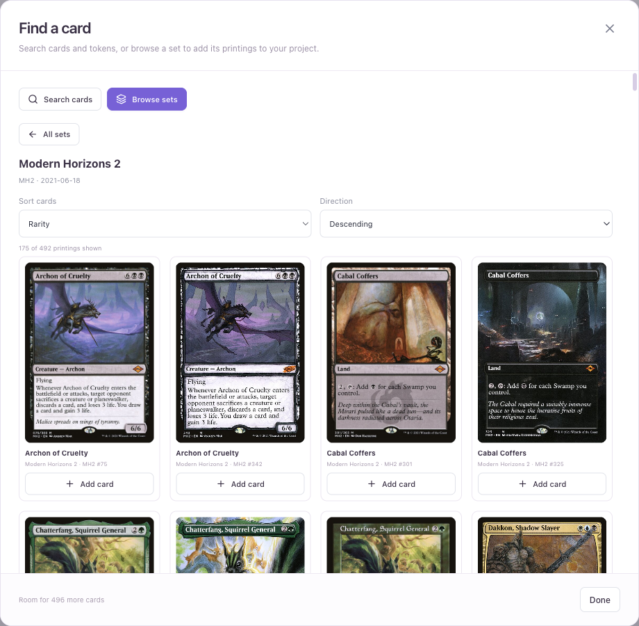
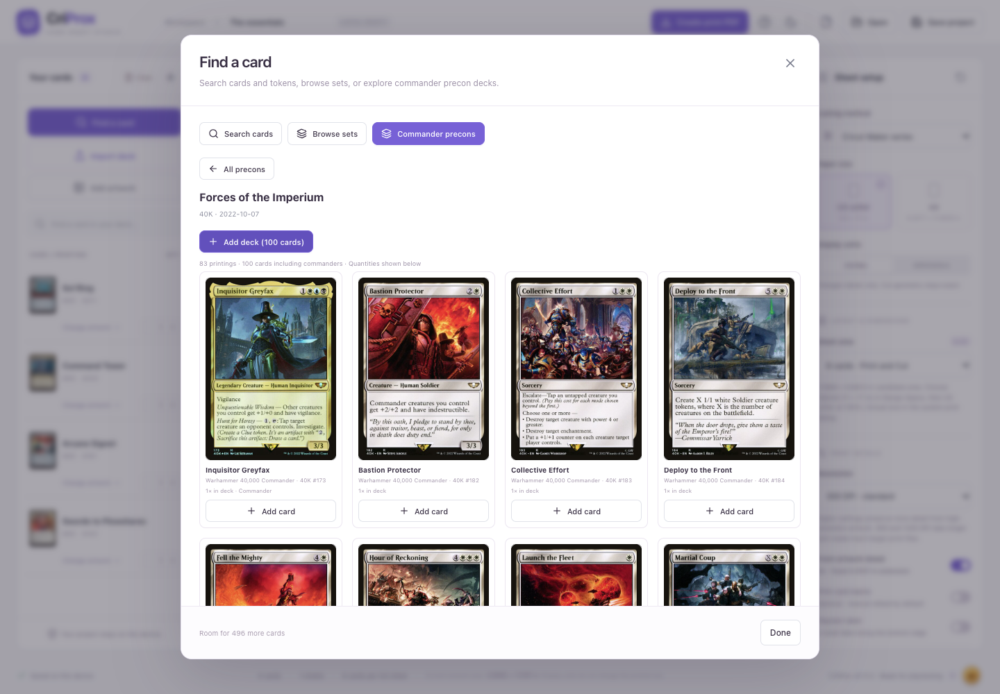
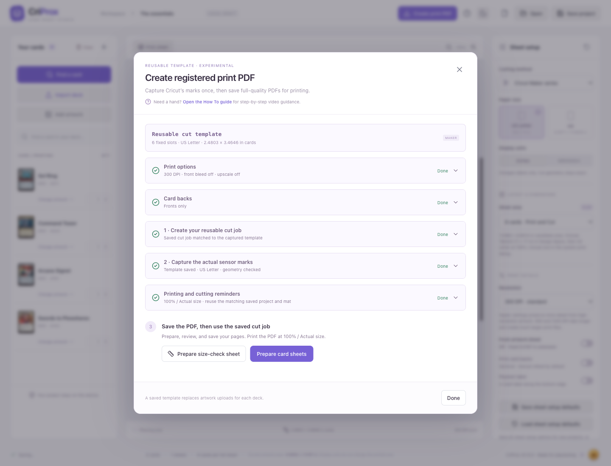

# Cricut workflow and physical validation

**Print the PDF. Cut with your saved Design Space project.** Design Space supplies the cut
template and registration marks during one-time setup. For each deck, CriProx saves the finished
PDF, a dedicated PDF application prints it, and Design Space runs the matching saved cut job.

To add cards by name, open **Find a card** and start typing. The search box receives keyboard
focus automatically when the dialog opens.

## Build a sheet from a set

1. Open **Find a card** and choose **Browse sets**. Filter by a set name or code, such as `MH2`.
   Paper sets include separate token and supplemental collections; digital-only sets are omitted.
2. Click a set to browse its printings. **Sort cards** offers collector number, name, color, rarity,
   mana value, and artist. Choose ascending or descending order; sorting covers the whole set.
3. Use **Load more cards** to continue browsing, and **Add card** under the artwork you want.
   Repeated additions increase that printing's quantity. Other printings of the same card keep their
   own artwork. Use **All sets** to select another set or **Search cards** to return to name search.
4. Choose **Done**, review the sheet and its quantities, then set paper, layout, bleed, and card backs
   before preparing the print PDF. The project limit remains 500 cards.

Set browsing needs an internet connection on first use. Successful catalog and card responses are
cached for one day. Viewed previews are cached separately by image URL and reused when you change
sort order, reopen Find Card, or restart the app. Newly encountered images still need a download;
older previews are evicted when the preview cache reaches 1,024 images or 128 MiB. Announced sets
can appear before searchable card artwork is available.

## Build a sheet from a commander precon

1. Open **Find a card → Commander precons**. Filter by a deck name or set code, such as `40K`,
   and choose **Newest first** or **Name A–Z** to sort the catalog.
2. Open a deck to see its included printings. Each card shows its deck quantity, and commanders
   are labeled. **Add card** adds one copy of that printing; repeat additions increase its quantity.
3. Use **Add deck** to add the commanders and mainboard together, preserving all quantities,
   including basic lands. Tokens, display commanders, sideboards, planes, and schemes are excluded.
   The whole deck must fit within the 500-card project limit and have artwork for every printing.
   If artwork is missing, retry or add the available cards individually.
4. Use **All precons** to choose another deck, or **Done** to review the sheet and prepare the
   print PDF with your chosen paper, layout, bleed, and card backs.

Precon decklists come from MTGJSON and their exact printing artwork comes from Scryfall. First use
needs an internet connection; catalog, decklists, and complete printing lookups are cached for one
day. Availability follows the source catalog rather than a fixed bundled list.

## Understand the integration boundary

CriProx does **not** generate or reproduce Cricut registration marks, create native Design Space project files, or control the machine. Design Space creates the sensor marks and owns the actual Print Then Cut job. CriProx's registered-print workflow preserves marks from a PDF that Design Space produced for the exact saved job.

The standard export PNG contains one opaque rounded silhouette per card and transparent gaps. Its companion SVG contains matched vector geometry, not registration data. Inspect the traced contour in Design Space before printing, and do not enable both the PNG's cut contours and the SVG paths unless you deliberately intend duplicate cuts.

The layout engine works in millimeters. PNG density metadata is included, but always set **both** Canvas dimensions to the values in the supplied manifest. Do not use Auto-Resize or printer fit-to-page. Design Space tracing, paper feed, printer scaling, cutter calibration, material, and mat condition can all add error after CriProx creates the files.

The dashed rectangle in the preview is a planning guide. It is not a registration mark or a certified, model-specific outline of Cricut's usable area. Machine selection records the intended target and tailors instructions; it does not emulate firmware or guarantee that a particular job will pass Design Space's checks.

## Recommended workflow: print the PDF, reuse the saved cut project

### One-time template setup

1. Choose your machine, output paper, and layout in CriProx, then open **Create print PDF** and download the magenta setup PNG.
2. Upload that PNG to Design Space as one flat **Print Then Cut** image, preserve transparency, and set both Canvas dimensions to the values shown with the template. Inspect the contours, then save the project and keep its mat arrangement unchanged.
3. Use Design Space's **Make → Send to Printer** flow to save the job's print output as a complete one-page portrait PDF at **100% / Actual size**, with bleed off. This captures the template; it does not print the deck. Follow the layout-specific paper settings below: six-card and seven-card captures use the selected output paper, while eight-card requires a complete Tabloid capture.
4. Import the captured PDF into CriProx. CriProx verifies the template and saves it for reuse with the matching cut geometry.

The two setup sections collapse automatically with green checks after a verified capture is
imported or loaded. Click either header to see the instructions again, download another setup
PNG, or replace the captured PDF. The check confirms template setup, not physical cut accuracy.

Choose **Done** in **Print options**, **Card backs**, or **Printing and cutting reminders** when
you have reviewed that section. It collapses into a short summary with a green check, and its
header always lets you reopen it. CriProx remembers completion locally for the exact machine,
paper, and cut geometry, including when reopening the app. Relevant settings or card-back
artwork changes reopen the affected section for review; an enabled back section cannot be marked
done while required shared artwork is missing. In the manual Cricut workflow, mark **Physical
cut calibration** done yourself after checking a real test; preparing a target does not complete it.

### For each deck

1. In **Create print PDF**, reopen any completed section you want to change, then prepare and
   inspect the card sheets and save the finished PDF from CriProx. The prepare controls stay visible
   when setup and settings are collapsed. Reminders sit above the prepare controls, so preparation
   leads directly into the preview and save actions.
2. Open the saved PDF in a dedicated PDF application and print on the selected output paper at **100% / Actual size**. Disable fit, shrink, headers, and added margins. CriProx saves PDFs rather than printing directly, preserving the selected artwork resolution and captured PDF content.
3. If backs are enabled, print their artwork onto the same sheets using the chosen refeed or duplex order. Back pages have no registration marks or cut lines.
4. Reopen the exact saved Design Space project and mat. Choose **Already Printed / Skip printing** when available, load the sheet front-side up as instructed, and run the cut.

Run a measured plain-paper test before using card stock. Reuse the template for later decks while
the cut geometry remains unchanged. Changes to paper, spacing, machine, layout, or the saved cut
job require a matching new capture; recapture after changes to Design Space or printer setup.
This reusable PDF process is outside Cricut's recommended print flow and still requires physical
validation on your equipment.

### Alternative: direct PNG printing through Design Space

The separate **Export** package contains artwork PNGs, SVG geometry, dimensions, and a handoff
guide. Its PNGs contain no registration marks. For six-card and seven-card direct PNG exports, upload the artwork PNG
as a flat Print Then Cut image, set both dimensions from the manifest, inspect the contours, and
let Design Space generate the marks and handle printing and cutting in the same session and
device. Eight-card exports direct you to **Create print PDF** instead. Use **Create print PDF**
for the reusable workflow described above.

## Experimental manual nine-card workflow

The nine-card profile is a separate Basic Cut workflow. It bypasses Print Then Cut and its optical
sensor marks. The print PDF and transparent cut PNG share one fixed 191 × 266 mm 3×3 geometry with
63 × 88 mm cards, 1 mm gutters, and 2.5 mm corners.

1. Select **9 cards · Manual Alignment · Experimental** and open **Create manual cut**.
2. Prepare the files. Save the print PDF and `basic-cut.png`; use the same PNG for every print page.
3. Open the PDF in a dedicated PDF application and print on the selected Letter or A4 paper in
   portrait orientation at **100% / Actual size**. Disable fit, shrink, headers, and added margins.
4. Upload the PNG to Design Space as **Basic Cut**, not Print Then Cut. Set both dimensions to
   **191 × 266 mm** (7.5197 × 10.4724 in), keep all nine shapes together, and save the project.
5. Choose **On Mat**. In the Prepare preview, keep the group upright with its top-left at the first
   0.25 in grid inset. Do not center, mirror, rearrange, or auto-resize it.
6. Place the printed page flush with the upper-left corner of the mat's adhesive grid and apply it
   smoothly. Keep the page orientation identical to the Design Space preview.
7. Choose **Prepare 1 mm calibration sheet** and print it on plain paper. Place it exactly as a card
   sheet and cut it with the existing saved nine-card Basic Cut project. The other eight paths cut
   blank paper; this is intentional, because the test must preserve the real project's placement.
8. At the top-left target, count the 1 mm magenta squares between the blade line and the dark left and
   top edges. Enter those measurements and directions in CriProx, then choose **Apply measured
   correction**. Prepare a new calibration PDF after changing the correction; the saved Basic Cut PNG
   and Design Space project do not change. The right and bottom edges should show the same translation;
   disagreement indicates scale or rotation rather than a simple X/Y offset.
9. Repeat the same mat load at least twice after each correction and measure several cards. A changing
   offset indicates paper placement, mat loading, or machine repeatability rather than a value that
   should be compensated in software. Use card stock only after the offset is repeatable.

On iOS, SnapMat can photograph the material on the mat and help visually place the cut group, but it
does not certify scale or replace the repeated physical test. The 191 × 266 mm design is smaller than
Cricut's published 11.5 × 11.5 in maximum cutting area for a 12 × 12 in mat; that size statement does
not guarantee alignment or machine-specific acceptance.

## Physical validation before a full deck

This is the remaining hardware acceptance test. It cannot be completed by a browser test or by comparing generated files.

1. Record the Cricut model, Design Space version, OS, printer/driver, paper size, material, and mat. Choose the corresponding machine in Design Space and CriProx.
2. Calibrate Print Then Cut using Cricut's built-in calibration flow.
3. In CriProx, leave the layout on **6 cards · Print and Cut** and select your desired card size. Open **Create print PDF** and download the reusable magenta setup PNG.
4. Upload the setup PNG as a flat/single-layer Print Then Cut image. Preserve transparency. Inspect its contours: exactly six rounded rectangles, with no interior holes. Set both Canvas dimensions to the values shown with the template. Confirm that Design Space accepts those dimensions without resizing, then save the project and mat arrangement.
5. For US Letter or A4 output, choose **Tabloid (11 × 17 in)** in Design Space. Use **Make → Send to Printer**, turn bleed off, and change the system print dialog to your selected output paper (**US Letter** or **A4**), portrait, at **100% / Actual size**. Save a PDF only if all six slots and all four sensor marks remain on one page, then import it into CriProx.
6. Choose **Prepare size-check sheet** and save its PDF. This is a physical measurement target, not a sensor calibration page. Print it from a dedicated PDF application at **100% / Actual size**, with fit-to-page/shrink-to-fit disabled. Reopen the exact saved Design Space project and mat, choose **Already Printed / Skip printing** when available, and cut the sheet following the model-specific mat-loading instructions.
7. Measure width and height of the cut card and its internal 5 mm grid. A consistent scale error suggests printer scaling or incorrect Canvas dimensions. Correctly sized grid with displaced edges suggests calibration/alignment. Record the error; do not change the physical card dimensions to conceal a sensor alignment issue.
8. Repeat using a full six-card PDF printed from the PDF application and cut with the same saved project. Measure every card, including diagonal position differences. Use three sheets to check repeatability. Decide your own acceptable tolerance before committing a full deck (for example, target at most 0.25 mm edge displacement if your equipment supports it). The 180 × 220 mm planning envelope is a candidate, not a validated Cricut area. Do not use Auto-Resize if rejected; use a smaller batch instead. Recheck the rotated card dimensions.

## Experimental seven-card test

The seven-card profile is a separate 2–3–2 test for Maker and Explore. It fixes the cards at 63 × 88 mm, the corners at 2.5 mm, the spacing at 0.1 mm, and the complete template at 189.2 × 214.2 mm. Do not modify those values.

1. Download the reusable setup template from **Create print PDF** and upload the magenta PNG as one flat Print Then Cut image.
2. Set both Canvas dimensions to 189.2 × 214.2 mm and confirm seven rounded contours. Save the project and keep its mat arrangement unchanged.
3. Choose **Tabloid (11 × 17 in)** as the Print Then Cut page size in Design Space. A4 is too narrow for the middle row.
4. Choose Make → Send to Printer, disable bleed, and open the system print dialog. Change the printer paper to **US Letter**, portrait, at **100% / Actual size**.
5. Save the setup as a PDF only if the preview remains one page with all seven magenta slots and all four sensor marks. Cancel if it clips a mark or creates a second page.
6. Import the resulting one-page Letter PDF into CriProx. Prepare and save a size-check PDF, then print it from a dedicated PDF application on Letter at **100% / Actual size**, with fit-to-page/shrink-to-fit disabled, before using a full artwork sheet.
7. Reopen the same saved Design Space project and mat, choose **Already Printed / Skip printing** when available, and cut the printed sheet. Design Space may require a 12 × 24 in mat because the declared page is Tabloid, even though the printed sheet is Letter.
8. Record sensor acquisition, every cut dimension, edge displacement, and repeatability. The successful one-page PDF capture confirms only the software geometry—not that a physical machine will read or cut it accurately.

## Experimental eight-card Tabloid capture

The eight-card profile fixes two horizontal cards per row across four rows at 63 × 88 mm per card, 1 mm gaps, and 2.5 mm corners. The complete magenta template is 177 × 255 mm.

1. Select the eight-card profile in CriProx, download its magenta setup PNG, and upload it to Design Space as one flat Print Then Cut image. Set both Canvas dimensions to 177 × 255 mm, save the project, and keep its mat arrangement unchanged.
2. Select portrait **Tabloid (11 × 17 in)** in Design Space and the system print dialog. Turn bleed off and save one complete Tabloid PDF at **100% / Actual size**. Keep every card and all four sensor marks on one page.
3. Import that PDF into **Create print PDF**. CriProx verifies the eight-card pattern and checks that all printed content fits on your selected portrait output paper (**US Letter** or **A4**) with at least 1 mm clearance. It moves the complete captured page content and card artwork together, without changing their size. A4 is narrower than Letter; captures that cannot fit are rejected.
4. Save the resulting size-check PDF and print it from a dedicated PDF application on the selected **US Letter** or **A4** paper at **100% / Actual size**, with fit-to-page/shrink-to-fit disabled. Check all four marks on plain paper.
5. Reopen the same saved Design Space project and mat, choose **Already Printed / Skip printing** when available, and cut the printed sheet. Confirm the machine reads the marks and cuts a 63 × 88 mm card before printing a full deck.

The Sheet area selector follows the selected paper and cutting method. Maker and Explore offer six-, eight-, and nine-card layouts for A4; seven-card remains Letter-only. Changing an eight-card project between Letter and A4 preserves its layout but requires a matching capture for the new output paper.

The earlier 0.1 mm-gap sample capture had a 7.63 × 10.63 in marked footprint and about 0.19 in top and bottom clearance after centering on Letter. The revised spacing needs a fresh Tabloid capture and a fit check for the selected output paper. Printer imageable area and borderless expansion can still clip marks. Reuse the same saved Design Space cut job and mat; a successful PDF fit alone does not prove sensor acquisition.

## Exact SVG template

Save repeatable preferences in **Settings → New project defaults**. Use **Sheet** for machine,
output paper, layout, and units; **Print** for DPI, front bleed, labels, and upscaling;
**Card backs** for shared artwork, back bleed, refeed or duplex, flip, and orientation; **Cut guides**
for manual guides; and **Alignment** for measured printer and cut corrections. Card dimensions, corner radius,
and spacing are fixed by the selected layout and cannot be edited in Settings. Changing machine or paper keeps layout choices
compatible.

Edits stay in one draft as you switch groups. **Save defaults** saves everything for future projects.
Select **Also apply to current project** to use the setup on the open deck as well; its name and
card list are preserved. **Use current project** copies that deck's setup into the draft, and
**Reset to factory** prepares factory choices. Review either before saving. **Undo changes** returns
to the saved defaults; closing with unsaved changes offers a choice to keep editing or discard.

In **Card backs**, review the artwork preview and source-bleed toggle. You can replace or remove
artwork; disabling backs keeps it saved for later. Upscaling choices stay with each project when
you close and reopen **Create print PDF**. If saved Upscayl is unavailable, choose Built-in ESRGAN
or turn upscaling off before preparing card sheets.

Front and back bleed controls are independent on/off toggles. Front bleed and the bleed between card backs are fixed at 0.5 mm for the six-card and eight-card profiles and 0.05 mm for the tightly spaced seven-card profile. Because back pages do not contain registration marks, enabled back bleed extends 1.5 mm past exposed outside edges to cover small front-to-back alignment shifts without changing card positions or cut geometry.

When a selected Scryfall card has two faces, CriProx warns that card-back printing is required. With
card backs enabled, the face opposite the selected front is placed in that card's mirrored back-side
slot automatically. The shared card-back artwork applies only to single-sided cards; it remains required
for a mixed deck that contains any single-sided cards.

Each PNG is accompanied by an SVG with the same dimensions, origin, card positions, rotation and rounded corners. It contains only opaque vector shapes, with no page background, strokes, registration marks, embedded images or clipping paths.

The PNG's alpha silhouette is the recommended Print Then Cut input. The SVG is supplied for inspecting the intended geometry or a separate Basic Cut workflow. It does not tell Cricut where an independently printed page lies. Do not add the SVG as another enabled cut layer over the PNG unless you are deliberately testing a different, validated workflow: that can cause duplicate cuts.

## Physical acceptance record

| Field                             | Value                        |
| --------------------------------- | ---------------------------- |
| Machine / firmware                | Pending                      |
| Design Space / OS                 | Pending                      |
| Printer / driver                  | Pending                      |
| Paper / material / mat            | Pending                      |
| Export settings / manifest        | Pending                      |
| Import dimensions confirmed       | Pending                      |
| Outer contour count confirmed     | Pending                      |
| Card dimensions after cutting     | Pending                      |
| Maximum edge displacement         | Pending                      |
| Repeatability across three sheets | Pending                      |
| Six-card result                   | Pending                      |
| Seven-card one-page PDF capture   | Passed; physical cut pending |
| Seven-card sensor / cut result    | Pending                      |
| Nine-card Basic Cut import        | Pending                      |
| Nine-card manual alignment result | Pending                      |

Until this record is filled in with real measurements, the application is a software-tested prototype, not a guarantee of perfect Cricut alignment.
